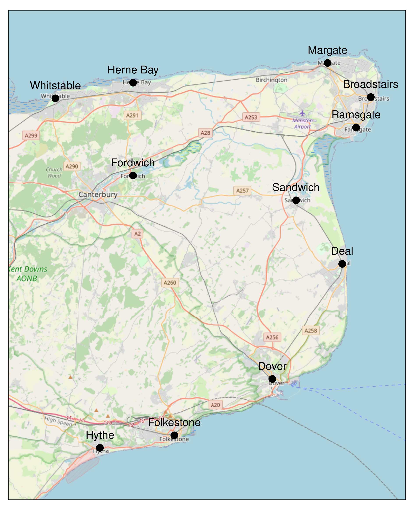
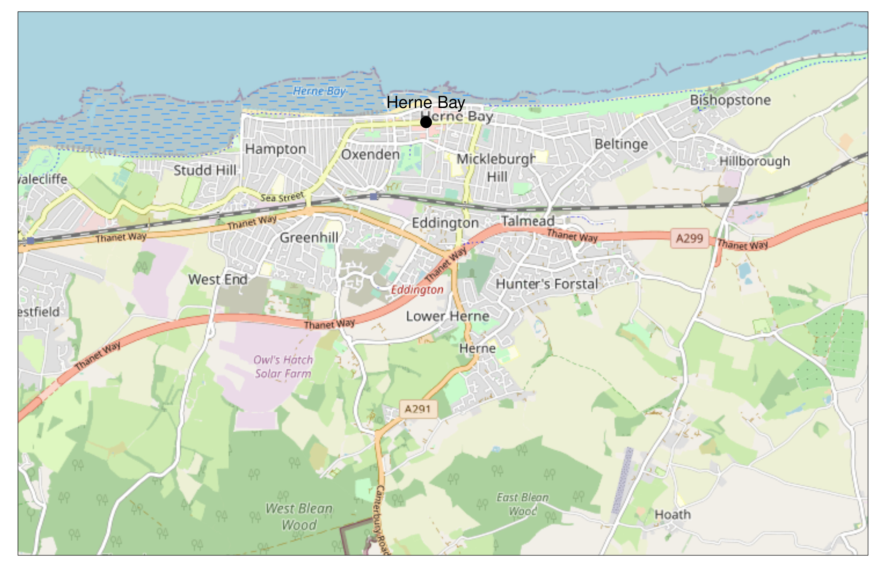
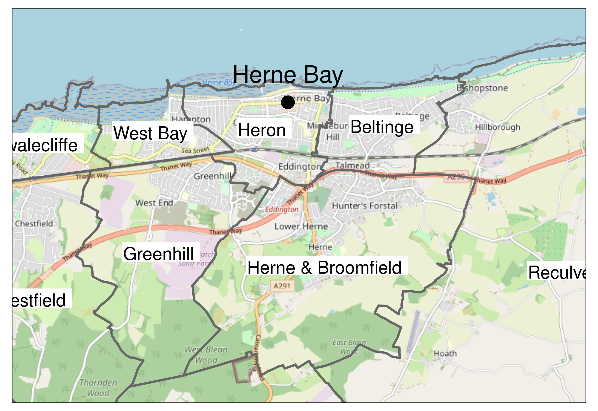
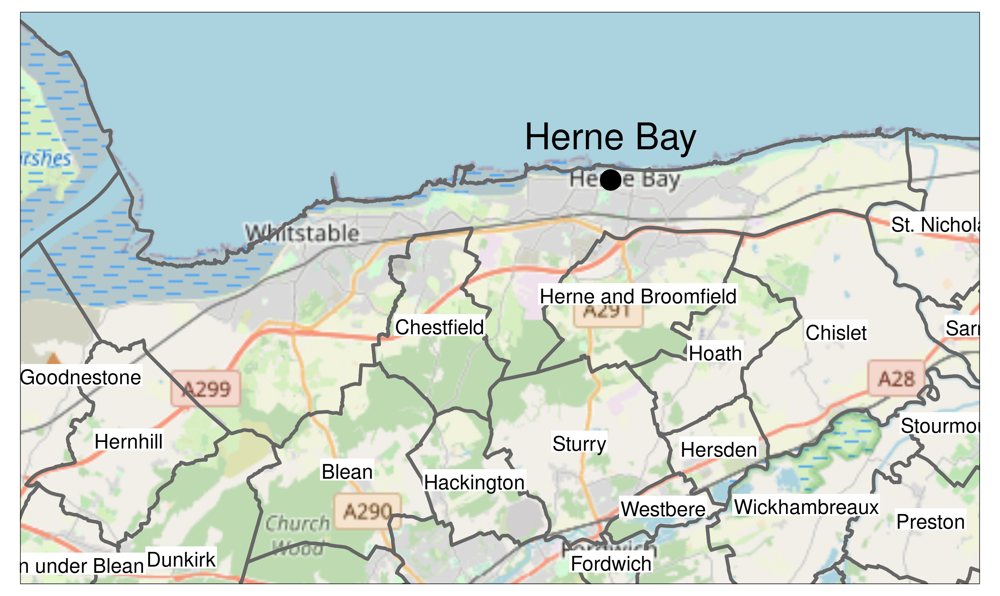
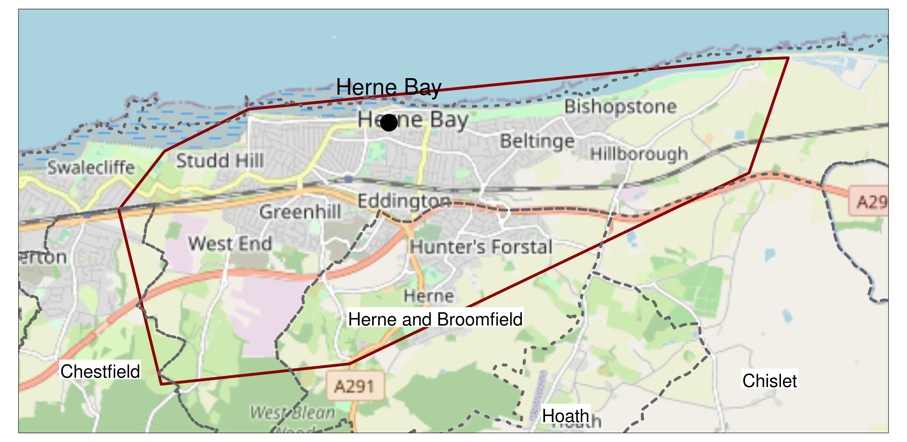
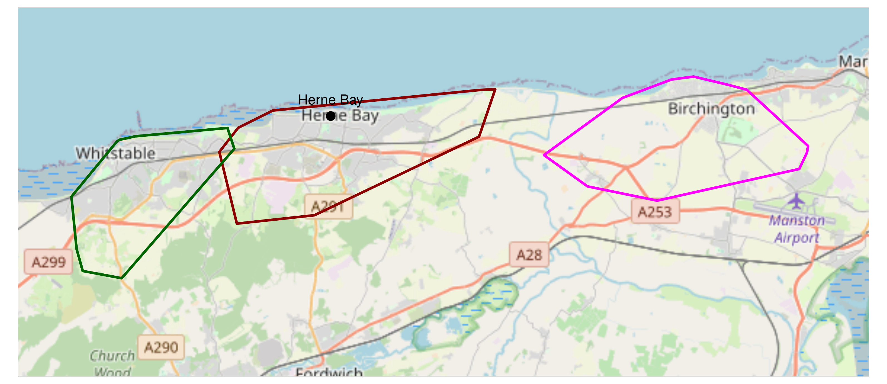
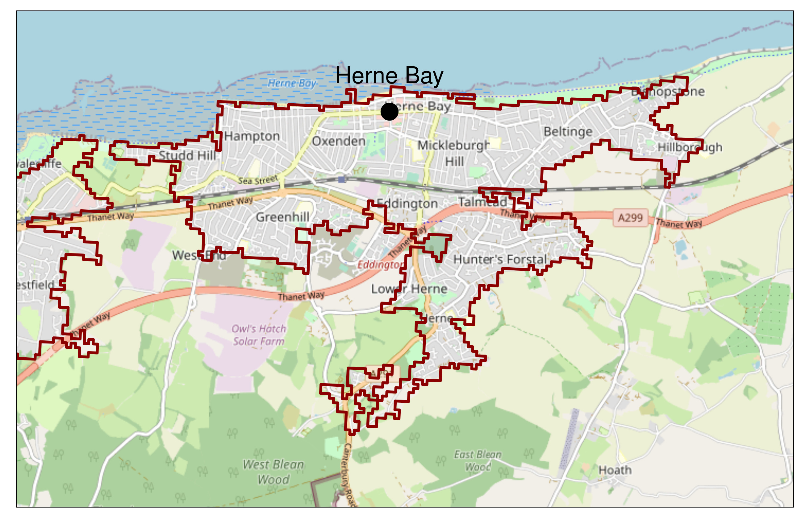
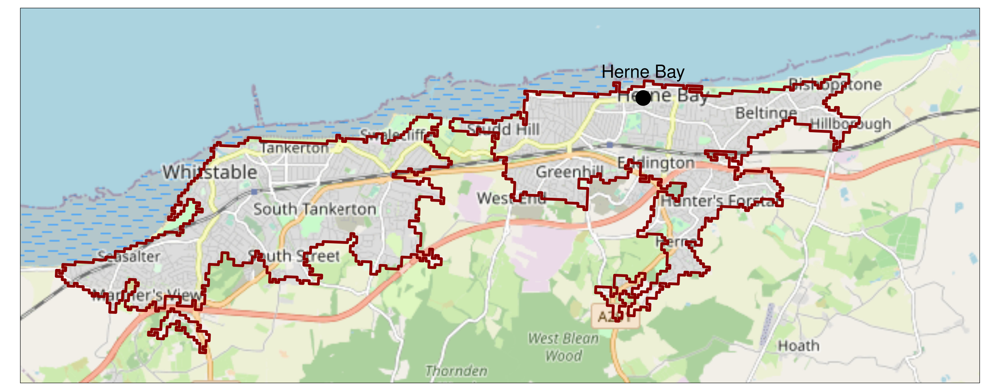
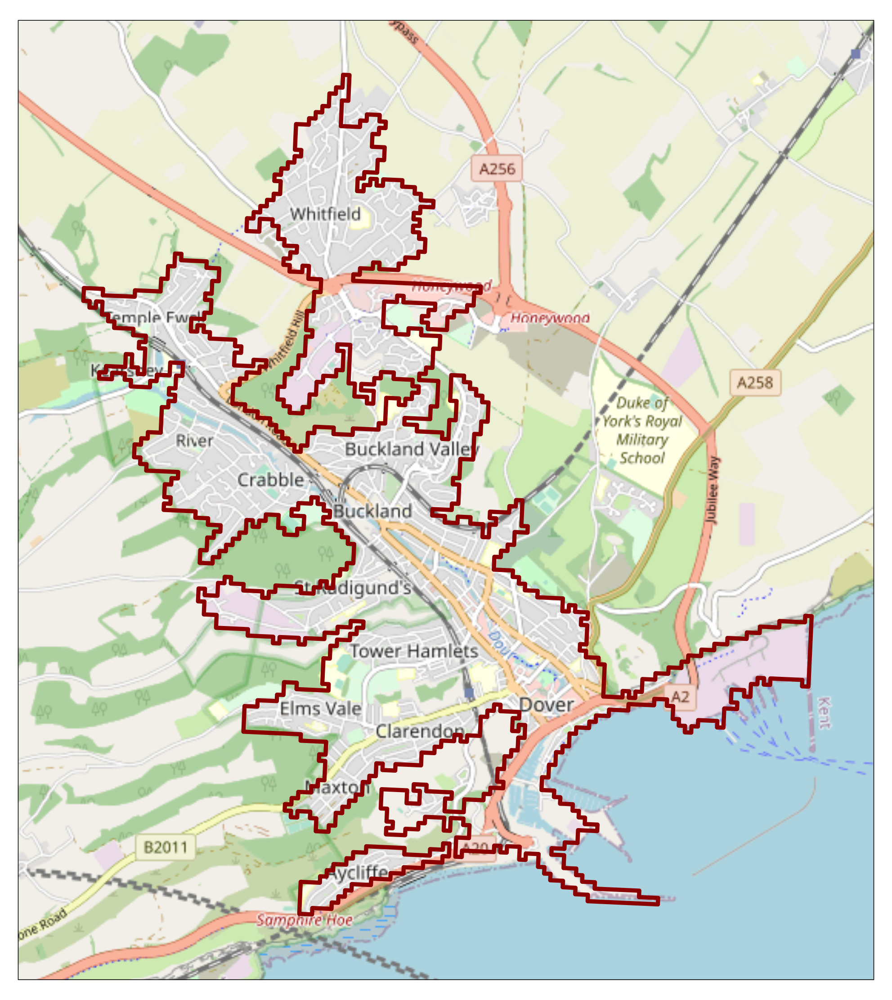
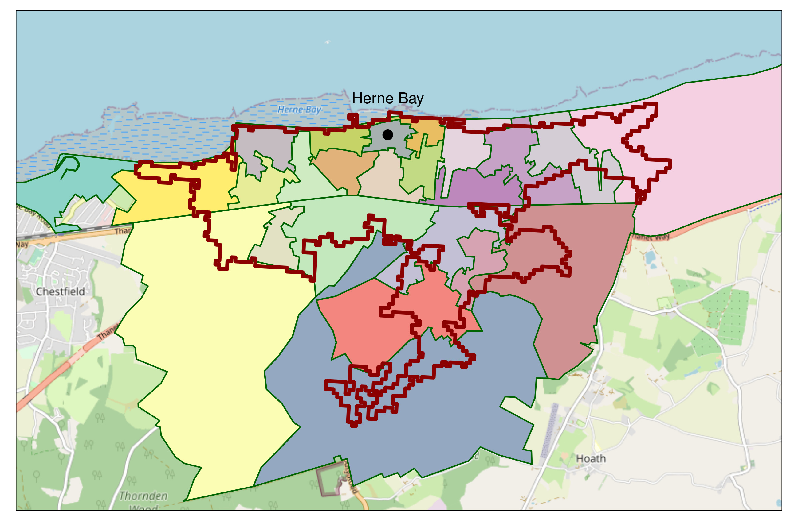

# What is a coastal town?

What is a coastal town? It sounds like a simple question to answer and probably one which brings to mind specific places: St Ives, Scarborough, Witby, Portree, Herne Bay, etc. But what can a place name tell us? 

If we want to answer research questions a name is not enough: we need information associated with each name in order to look for differences in that information between different entities or groups of entities. How can we determine, for example, what the mortality rate from diabetes is in "coastal towns" or in "inland towns"? Where would this information come from, and at what level has it been recorded? Is the mortality rate recorded per town or is it recorded at a lower or higher spatial resolution in some other dataset? How can we associate this information with a given place name if that is the case? 

These are the questions which prompt us to take the problem seriously and so let us consider Herne Bay in Kent as an example of a Coastal Town and explore the hidden complexity underlying this seemingly simple question "What is a coastal town?".

# The names of places

Ordnance Survey maintains a list of place names in a product called "OS Open Names" [@OrdnanceSurveyGB2023] which is free to use for research purposes. The dataset is split into cities, towns, villages, hamlets, other settlements, and suburban areas. The technical specification for the product [@OrdnanceSurveyGB2023a] provides the following definition for town within the product:

> A centre of business and population with an area in excess of 2.5 square kilometres. Some smaller places are also historically considered towns, for example, where they are market or former county towns.

This raises the question, how is the area determined? The technical specification does not provide a direct answer but page 4 of [@OrdnanceSurveyGB2023a] states:

> Settlements are sourced from an internal OS data store. For LocalType City and Town, the geometry supplied is the notional centre of the settlement (the position that the majority of informed people would accept as being the 'centre' of the settlement) and the position has been manually captured. 
> 
> For all other settlement types, the position has been generated from the major road junction within the settlement, using OS MasterMap Highways Network.

It would appear that town's centre is something manually determined by humans at Ordnance Survey, but how the area is ascertained is not clear.

Figure \@ref(fig:seTowns) shows the settlements defined as towns located in the southeast of England. Herne Bay is shown in the top middle of the figure.

```{r seTowns,echo=F,fig.cap="Towns in the southeast of England as defined by Ordnance Survey",out.width='80%',fig.align="center",fig.pos='H'}

```

# Extent of Herne Bay

We have a definition of a town but the only information we have associated to it is a centroid, defined manually by Ordnance Survey. Cleary a town is not just a centroid, it has an extent. How can we capture this extent? Let us examine Herne Bay in closer detail.

Figure \@ref(fig:hbClose) zooms in on Herne Bay.

```{r hbClose,echo=F,fig.cap="Herne Bay, a coastal town in the southeast of England",out.width='80%',fig.align="center",fig.pos='H'}

```

From the figure are we to assume that "Herne Bay" is the small area between Oxenden and Mickleburgh Hill? We know from the OS Open Places definition that the area of a town must be at least 2.5 square kilometers, but the area between Oxenden and Mickleburgh Hill is approximately 0.75 square kilometers so this cannot be correct. We can see that Herne Bay constitutes a continous built-up area extending from Studd Hill to Bishopstone along the coast. We know that it is at-least 2.5 square kilometers, but we do not know the shape or total extent of the town as this information has not been provided.

## Administrative boundaries

How might this extent be determined? One proposal is to use existing administrative boundaries. Ordnance Survey provide a dataset containing all the administrative boundaries in the UK under the name Boundary-Line [@OrdnanceSurveyGB2023b].

### Election Wards

Figure \@ref(fig:hbWards) shows the map zoomed onto Herne Bay with the election wards in that area labelled.

```{r hbWards,echo=F,fig.cap="The election wards surrounding Herne Bay",out.width='80%',fig.align="center",fig.pos='H'}

```

Election ward boundaries for local authorities in the UK are set so that the number of people per representative is roughly equal as well as taking into consideration community identity and geographic features that might signify natural boundaries. Looking at the figure, one could argue that Heron and Beltinge represent Herne Bay but there are no official associative lists or 1-to-1 mapping between towns and wards and wards can span town boundaries.

### Civil Parishes

The smallest unit of governence in the UK is the civil parish and in many cases the civil parish would be a good approximation for the extent of a town or village, however this is not always the case and a town can be comprised of multiple civil parishes. 

In some cases there is no civil parish because governence of the area has been subsumed to a regional authority. This is the case for Herne Bay which is governed by Canterbury City Council and falls within an unparished area that also encompasses Whitstable.

Figure \@ref(fig:unParished) shows the unparished area that encompasses Herne Bay and Whitstable with surrounding parished areas shown for context.

```{r unParished,echo=F,fig.cap="The unparished area containing Herne Bay",out.width='80%',fig.align="center",fig.pos='H'}

```

So we are still no closer to determining the physical extent of Herne Bay.

## Address based convex hull

Ordnance Survey offer another product called AddressBase Core [@OrdnanceSurveyGB2023c] which provides the centroid for every address in Great Britain. What would the convex hull of all addresses look like whose "Town Name" field matches "Herne Bay"?  The resulting convex hull is shown in Figure \@ref(fig:addressConvex).

```{r addressConvex,echo=F,fig.cap="Convex hull of all addresses whose \"Town Name\" matches \"Herne Bay\". Local parish boundaries are shown as dotted lines and parishes are labelled.",out.width='80%',fig.align="center",fig.pos='H'}

```

Comparing with other figures, the convex hull of addresses does appear to capture the urban area of Herne Bay but also extends outwards beyond it by a considerable extent into the parish of Herne and Broomfield.

How useful might this convex hull method be in general? We can carry it out for the adjacent town Whitstable, as well as the area known as Birchington which is not a town. The result of this is shown in Figure \@ref(fig:addressConvexPlus)

```{r addressConvexPlus,echo=F,fig.cap="Convex hulls of all addresses whose \"Town Name\" matches \"Whitstable\" and \"Herne Bay\", and whose address contains \"Birchington\".",out.width='100%',fig.align="center",fig.pos='H'}

```

The convex hull for Whitstable is reasonable in the sense it appears to capture the urban area of Whitstable near to the coast but extends far beyond the urban area into rural areas.

The convex hull for Birchington is not a good representation of the urban area near to the coast as it extends far beyond this into rural areas.

In summary, the address based convex hull is potentially a useful method in establishing town boundaries perhaps in combination with other data.

## Built up Area data

Each national census in the UK defines certain geographies for which data can be extracted. The 2011 census  [@OfficeforNationalStatistics2021] defines various output areas including one called "Built up Areas" or BUAs. Figure \@ref(fig:hbBUA) plots the BUA that corresponds to the area "Herne Bay / Whitstable".

```{r hbBUA,echo=F,fig.cap="Built Up Area of for \"Herne Bay / Whitstable\" focused on Herne Bay ",out.width='100%',fig.align="center",fig.pos='H'}

```

Whilst the BUA appears to do an excellent job of covering the urban area of Herne Bay, it also covers Whitstable as can be seen from Figure \@ref(fig:hbAndWhitsBUA).

```{r hbAndWhitsBUA,echo=F,fig.cap="Built Up Area of for \"Herne Bay / Whitstable\" showing both Herne Bay and Whitstable",out.width='100%',fig.align="center",fig.pos='H'}

```

If the goal is to determine a rigorous definition of "Coastal Town", this sort of data mangling is not helpful as it implies the use of manual separation of aggregate BUAs to specific regions.

Fortunately in the case of Herne Bay and Whitstable these are already separated in a dataset called Built Up Areas Subdivisions (BUASD) [@OfficeforNationalStatistics2011a] but this is not always the case, as the BUASD containing the built up area of Birchington also includes Margate and Westgate.

Another example is Dover which has a BUA but no BUASDs. Dover's BUA is shown in Figure \@ref(fig:doverBUAPrecise).

```{r doverBUAPrecise,echo=F,fig.cap="Built Up Area of for \"Dover\"",out.width='100%',fig.align="center",fig.pos='H'}

```

Is it reasonable to suggest that Whitfield is part of Dover as a Coastal Town?

# Summarising census data for a place

We have examined several methods for defining a town boundary with the most promising being the convex hull of addresses within that town or the built up area (or subdivision) corresponding to the town if this data exists.

Once we manage to define a boundary for a place it becomes much easier to find additional information about that place. We can lookup relevant census geographies, for example for 2011 [@OfficeforNationalStatistics2011a] or 2021 [@OfficeforNationalStatistics2021] and aggregate data that intersects with our boundary.

## LSOA data

The lowest level of resolution to which census data is collected is called the Lower layer Super Output Area (LSOA), LSOAs with the aim to keep household counts between 400 and 1200. With LSOA boundaries we can aggregate census data to any encompassing boundary by summing statistics (with weights from [0-1] for partially intersecting LSOAs).

Figure \@ref(fig:hbBUALSOAs) shows the BUASD outline for Herne Bay with the LSOA areas contained within it.

```{r hbBUALSOAs,echo=F,fig.cap="Built Up Area Sub Division of for \"Herne Bay\" with LSOA areas shown within it.",out.width='100%',fig.align="center",fig.pos='H'}

```

The BUASD boundary and the LSOA boundaries do not perfectly coincide so any aggregate statistic based on the LSOA take into account the actual intersection with the BUASD boundary or whatever boundary is being used to define the town.

# References
