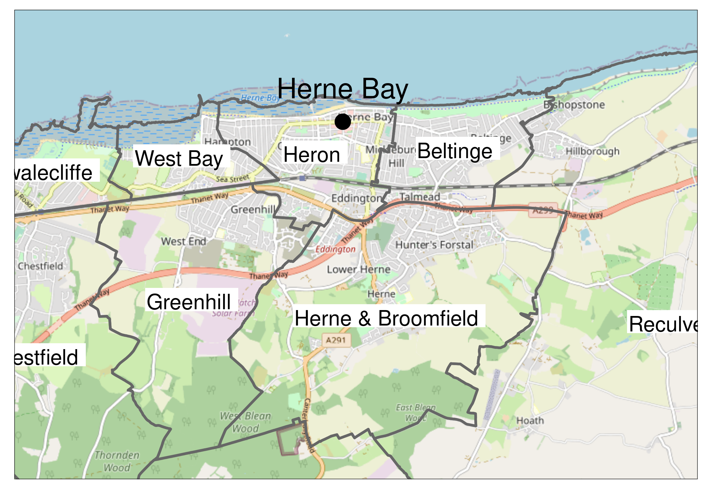

# What is a coastal town?

What is a coastal town? It sounds like a simple question to answer and probably one which brings to mind specific places: St Ives, Scarborough, Witby, Portree, Herne Bay, etc. But what can a place name tell us? 

If we want to answer research questions a name is not enough: we need information associated with each name in order to look for differences in that information between different entities or groups of entities. How can we determine, for example, what the mortality rate from diabetes is in "coastal towns" or in "inland towns"? Where would this information come from, and at what level has it been recorded? Is the mortality rate recorded per town or is it recorded at a lower or higher spatial resolution in some other dataset? How can we associate this information with a given place name if that is the case? 

These are the questions which prompt us to take the problem seriously and so let us consider Herne Bay in Kent as an example of a Coastal Town and explore the hidden complexity underlying this seemingly simple question "What is a coastal town?".

# The names of places

Ordnance Survey maintains a list of place names in a product called "OS Open Names" [@OrdnanceSurveyGB2023] which is free to use for research purposes. The dataset is split into cities, towns, villages, hamlets, other settlements, and suburban areas. The technical specification for the product [@OrdnanceSurveyGB2023a] provides the following definition for town within the product:

> A centre of business and population with an area in excess of 2.5 square kilometres. Some smaller places are also historically considered towns, for example, where they are market or former county towns.

This raises the question, how is the area determined? The technical specification does not provide a direct answer but page 4 of [@OrdnanceSurveyGB2023a] states:

> Settlements are sourced from an internal OS data store. For LocalType City and Town, the geometry supplied is the notional centre of the settlement (the position that the majority of informed people would accept as being the 'centre' of the settlement) and the position has been manually captured. 
> 
> For all other settlement types, the position has been generated from the major road junction within the settlement, using OS MasterMap Highways Network.

It would appear that town's centre is something manually determined by humans at Ordnance Survey, but how the area is ascertained is not clear.

Figure \@ref(fig:seTowns) shows the settlements defined as towns located in the southeast of England. Herne Bay is shown in the top middle of the figure.

```{r seTowns,echo=F,fig.cap="Towns in the southeast of England as defined by Ordnance Survey",out.width='80%',fig.align="center",fig.pos='H'}

```

# Extent of Herne Bay

We have a definition of a town but the only information we have associated to it is a centroid, defined manually by Ordnance Survey. Cleary a town is not just a centroid, it has an extent. How can we capture this extent? Let us examine Herne Bay in closer detail.

Figure \@ref(fig:hbClose) zooms in on Herne Bay.

```{r hbClose,echo=F,fig.cap="Herne Bay, a coastal town in the southeast of England",out.width='80%',fig.align="center",fig.pos='H'}

```

From the figure are we to assume that "Herne Bay" is the small area between Oxenden and Mickleburgh Hill? We know from the OS Open Places definition that the area of a town must be at least 2.5 square kilometers, but the area between Oxenden and Mickleburgh Hill is approximately 0.75 square kilometers so this cannot be correct. We can see that Herne Bay constitutes a continous built-up area extending from Studd Hill to Bishopstone along the coast. We know that it is at-least 2.5 square kilometers, but we do not know the shape or total extent of the town as this information has not been provided.

## Administrative boundaries

How might this extent be determined? One proposal is to use existing administrative boundaries. Ordnance Survey provide a dataset containing all the administrative boundaries in the UK under the name Boundary-Line [@OrdnanceSurveyGB2023b].

### Election Wards

Figure \@ref(fig:hbWards) shows the map zoomed onto Herne Bay with the election wards in that area labelled.

```{r hbWards,echo=F,fig.cap="The election wards surrounding Herne Bay",out.width='80%',fig.align="center",fig.pos='H'}

```

Election ward boundaries for local authorities in the UK are set so that the number of people per representative is roughly equal as well as taking into consideration community identity and geographic features that might signify natural boundaries. Looking at the figure, one could argue that Heron and Beltinge represent Herne Bay but there are no official associative lists or 1-to-1 mapping between towns and wards and wards can span town boundaries.

### Civil Parishes

The smallest unit of governence is the civil parish and in many cases the civil parish would be a good approximation for the extent of a town or village, however this is not always the case and a town can be comprised of multiple civil parishes. 

In some cases there is no civil parish because governence of the area has been subsumed to a regional authority. This is the case for Herne bay which is governed by Canterbury City Council and falls within an unparished area that also encompasses Whitstable.

Figure \@ref(fig:unParished) shows the unparished area that encompasses Herne Bay and Whitstable with surrounding parished areas shown for context.

```{r unParished,echo=F,fig.cap="The unparished area containing Herne Bay",out.width='80%',fig.align="center",fig.pos='H'}

```

So we are still no closer to determining the physical extent of Herne Bay.

## Address based convex hull

Ordnance Survey offer another product called Addressbase Core which provides the centroid for every address in Great Britain. What would the convex hull of all addresses containing the line "Herne Bay" look like?
